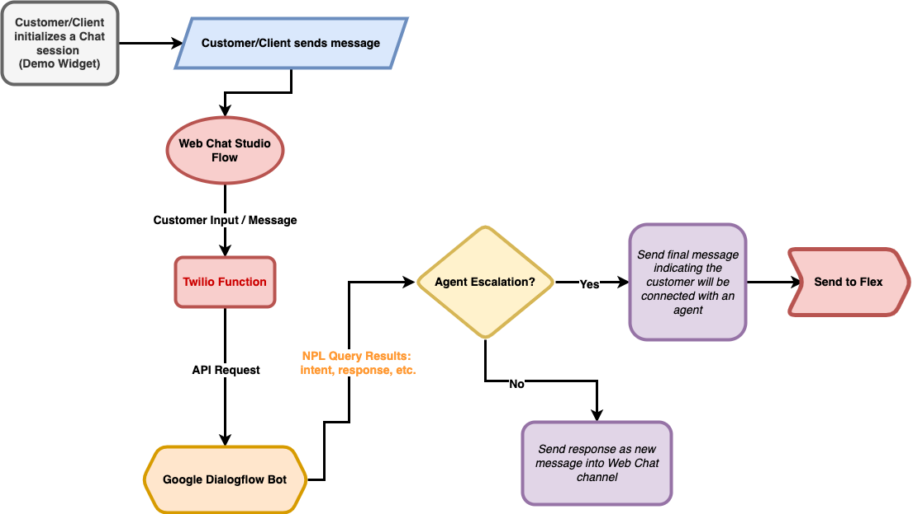
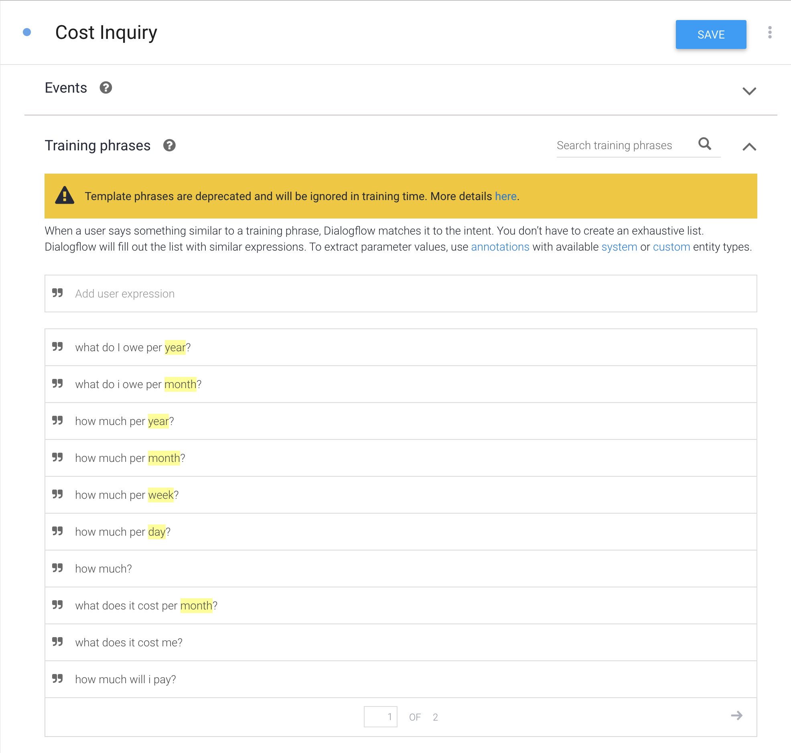
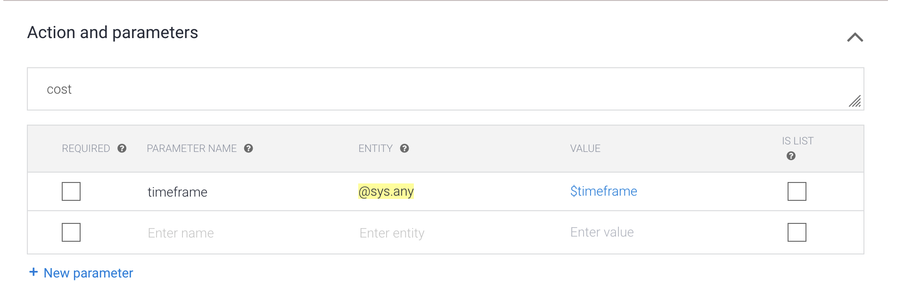
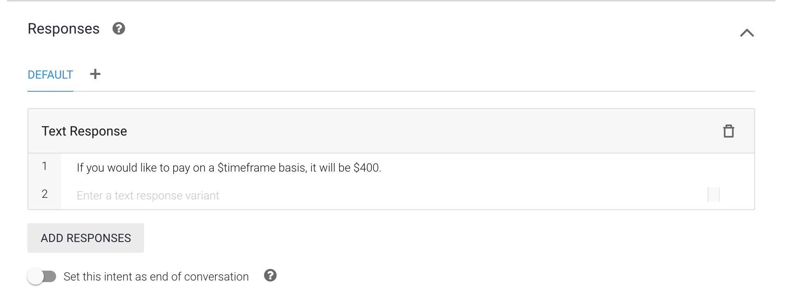
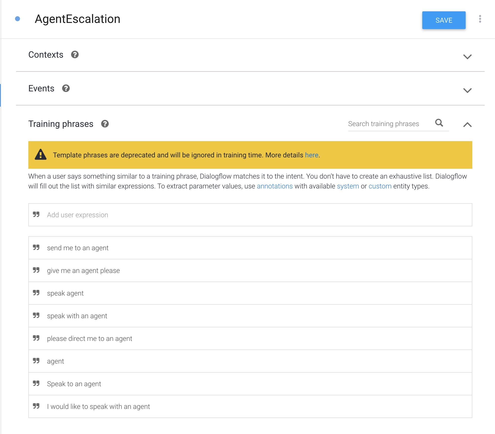
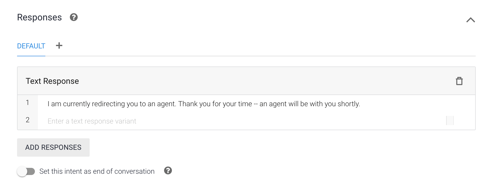
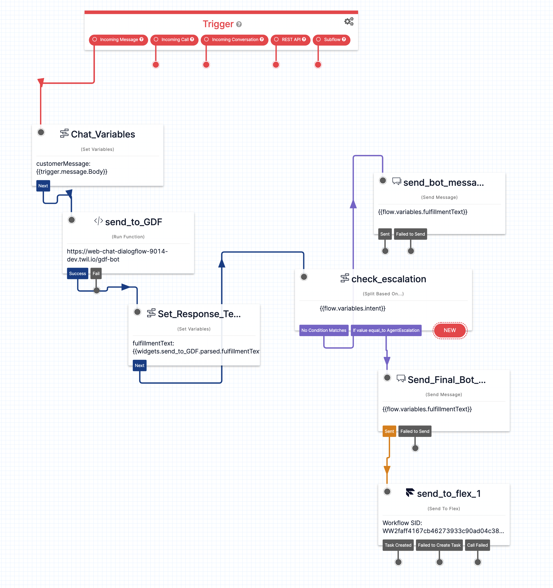

<a  href="https://www.twilio.com">

</a>

# Twilio Web Chat + Google Dialogflow Integration

This repository outlines how a `Twilio Function` can be used to query a `Google Dialogflow` bot to respond to customers engaging with the Web Chat channel. When a chat session is started, a Studio flow relays the customer message to the Twilio function, which then returns the NLP query response to Studio. The direct response from Dialogflow is delivered to the customer with a `Send Message` block within the Studio flow.

If the Google Dialogflow bot detects the customer would like to speak to an agent, an `Agent Escalation` intent is checked in the Studio flow and routes them to an available agent in Flex.

---

## Functionality Overview

### Technical Components

- **Twilio Serverless Function** - used to orchestrate the API requests to Google Dialogflow
- **Twilio Studio Flows** - custom studio flow to handle incoming messages and responses to the client side
- **Twilio Flex** - agent escalation use case
- **Google Dialogflow** - given a message (text), NLP processing determines the intent and response
- **Google Cloud Platform** - houses the service account credentials to perform authenticated API calls from the Twilio Function

### Diagram



---

## Setup

### Requirements

To deploy this function, you will need:

- An active Twilio account with Flex provisioned. Refer to the [Flex Quickstart](https://www.twilio.com/docs/flex/quickstart/flex-basics#sign-up-for-or-sign-in-to-twilio-and-create-a-new-flex-project") to create one.
- [Google Dialogflow Agent](https://dialogflow.cloud.google.com/) and access to the [Google Cloud Platform](https://cloud.google.com/)
- npm version 5.0.0 or later installed (type `npm -v` in your terminal to check)
- Node.js version 14 (type `node -v` in your terminal to check)
- [Twilio CLI](https://www.twilio.com/docs/twilio-cli/quickstart#install-twilio-cli) along with the [Serverless Plugin](https://github.com/twilio-labs/serverless-toolkit/tree/main/packages/plugin-serverless). Run the following commands to install them:
  ```bash
  # Install the Twilio CLI
  npm install twilio-cli -g
  # Install the Serverless and Flex as Plugins
  twilio plugins:install @twilio-labs/plugin-serverless
  ```

### Google Dialogflow

Starting with the Google Dialogflow agent, we need to create a new agent and do some initial configuration of intents.

1. Navigate to https://dialogflow.cloud.google.com/

2. Login.

3. Click on the cog on the left, and then click on create a new agent.


4. Give it a name, set the default time zone and press create.

5. It should take a few seconds to create the agent. Next, let's build a couple intents:

   #### Cost Inquiry

   
   
   

   #### AgentEscalation

   
   

6. We now have our agent configured with a couple intents so we are ready to move on. We will need a Google service account to access the agent via API. To set this up, navigate to the general agent options by clicking on the cog once again. Make sure you make a note of your project id, as you will need it later.


### Google Cloud Platform

You've now created the agent on the Dialogflow console and clicked on the project ID to navigate to the GCP console.

To allow our Twilio Function to perform authenticated API requests to Dialogflow, we will need a service account. We can create these via the GCP console by following this procedure:

1. Click on the Navigation Menu on the top left, and under "IAM and Admin", click on "Service Accounts":


2. Click on the create service account on the top, fill in the form, and then click “Create and Continue”:


3. Click on "Select a role", pick "Dialogflow Service Agent", then press "Continue", and finally press"Done" to complete this process.The account should look something like this:


4. Finally, click on the three dots under "Actions" then "Manage Keys", click on "Add Key" then "Create New Key". Pick a JSON type key and press “Create”. Your browser will download a JSON file automatically. We will use this JSON file within our Twilio Function in the following section.

### Twilio Serverless Function Deployment

We now need to deploy the function that will facilitate the API calls to the Google Dialogflow Bot. The function is called from the Studio flow responsible for handling the Web Chat channel. After querying the bot with the customer input (message), a JSON payload containing the Dialogflow results are available to the Studio flow. For further information on the technical functionality, please review `./functions/gdf-bot.protected.js`.

#### Pre-deployment Steps

1. While at the root directory, install package dependencies, and then rename `.env.example`. **Note:** as part of the package installation, the npm package `@google-cloud/dialogflow` is used to send API requests to the Dialogflow bot.

   ```bash
   # Install required dependencies
   npm install
   # Rename example env file
   cp .env.example .env
   ```

2. Open `.env` with your text editor and set the environment variables mentioned in the file.

   ```
   ACCOUNT_SID=ACXXXXXXXXXXXXXXXXXX
   AUTH_TOKEN=aXXXXXXXXXXXXXXXX
   ```

3. Rename the credentials JSON downloaded from the Service Account creation to `gcp_sa.private.json` and add it into the `/assets` directory.

4. Deploy the Twilio function to your account using the Twilio CLI:

   ```bash
   twilio serverless:deploy

   # Example Output
   Deploying functions & assets to the Twilio Runtime
   ⠇ Creating 1 Functions
   ✔ Serverless project successfully deployed

   # Deployment Details
   Domain: https://web-chat-dialogflow-xxxx-dev.twil.io
   Service:
       web-chat-dialogflow (ZSxxxx)
   # ..
   ```

### Studio Flow Creation

Now we need to create a new Studio flow to handle the incoming messages for Web Chat (_note_: editing the existing Web Chat flow configured into Flex is also an option).



#### Widget Details

- **Chat_Variables** - sets the incoming message text to a variable named `customerMessage`
- **send_to_GDF** - configured to execute the Twilio function deployed in the previous step, with a _Function Parameter_ of `customerMessage` set to `{{flow.variables.customerMessage}}`
- **Set_Response_Text** - sets two more variables based off the response from Dialogflow:
  - `fulfillmentText`: `{{widgets.send_to_GDF.parsed.fulfillmentText}}`
  - `intent`: `{{widgets.send_to_GDF.parsed.intent.displayName}}`
- **check_escalation** - checks the `intent` flow variable if an agent escalation is needed
- **send_bot_message** - delivers the bot response to the Web Chat channel
- **Send_Final_Bot_Message** - delivers final message from bot indicating the session will be handed off to an agent
- **send_to_flex_1** - sends the chat session over to Flex to be picked up by an available agent

#### Configuring Flex

After setting up the Studio flow outlined above, it is time to configure Flex to route incoming Web Chat messages to this flow.

1. Navigate to the Flex product page in the Twilio Console.
2. Click on `Manage` > `Messaging`.
3. Under the `WebChat` row entry, click the `Edit` button and select the new Studio flow created in the previous step.
4. Flex is now configured to route incoming WebChat messages to the new Studio flow.

---

## Test Setup

To test this solution:

1. Launch Flex from the Twilio console.
2. Ensure you are set to `Available` to enable the ability to receive incoming WebChat tasks as an agent.
3. Launch the demo chat widget from the admin screen in Flex.
4. Enter a chat message to observe the responses from Google Dialogflow.
5. Enter one of the training phrases for the `Agent Escalation` path, then view the incoming task in Flex.

---

## Appendix

- Guidance for this approach was sourced from this Twilio blog article: [Add Natural Language Processing Capabilities to your Twilio Flex Contact Center IVR and Messaging Channels with Google Dialogflow ES](https://www.twilio.com/blog/natural-language-processing-flex-google-dialogflow-es)

---

## Changelog

### 1.0.0

**May 23, 2022**

- Updated README with overview, setup instructions and screenshots.

## Disclaimer

This software is to be considered "sample code", a Type B Deliverable, and is delivered "as-is" to the user. Twilio bears no responsibility to support the use or implementation of this software.
